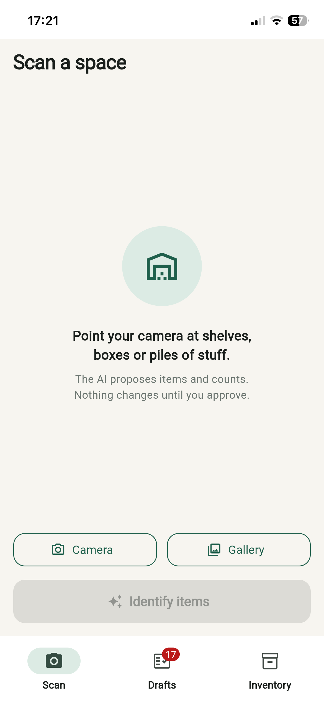
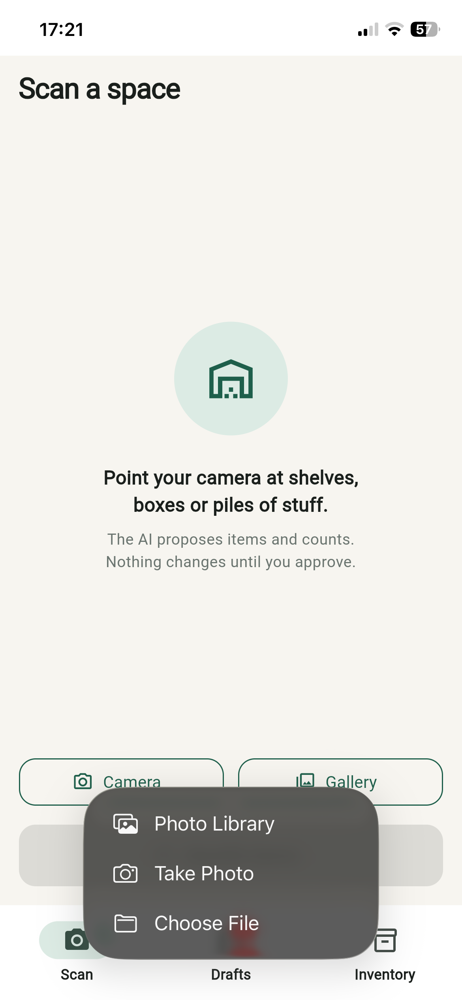
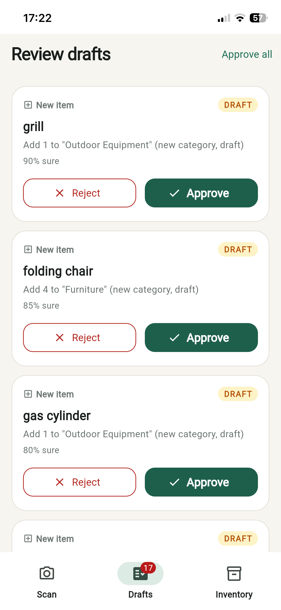
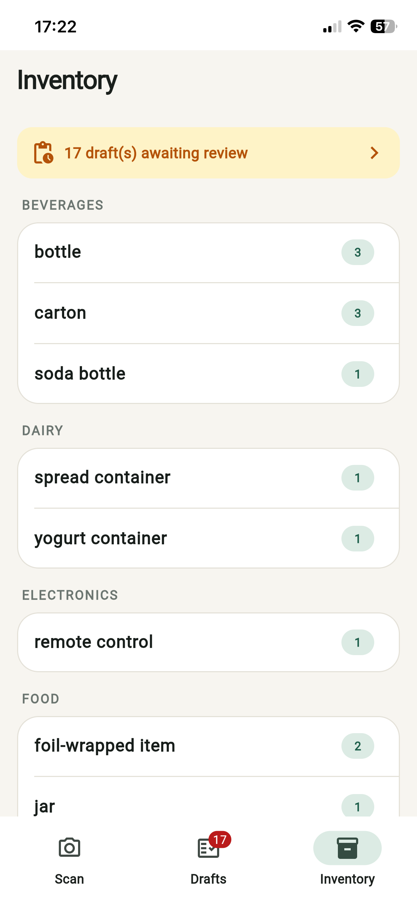

<div align="center">

# 📦 Intellygent Warehouse

**Point your camera at a messy warehouse, garage or market stall — get a counted, categorized inventory. Nothing goes live until a human approves it.**

[](https://flutter.dev)
[](https://dart.dev)
[](https://riverpod.dev)
[-FF6F00)](https://drift.simonbinder.eu)
[](https://platform.openai.com)
[](https://vercel.com)
[]()

*Android · iOS · Web (PWA) — one Flutter codebase*

</div>

---

## AI-automated warehouse & stock management

Photograph your shelves — the AI does the stocktaking:

- 🔍 **Auto-detects every item/article** in the photos
- 🔢 **Counts the total quantity** of each article across all shots
- 🗂️ **Auto-categorizes** items, creating new categories when needed
- 🔁 **Detects stock changes** on known articles as `old → new` proposals
- ✅ **Nothing goes live without you** — every AI result is a draft you approve or reject with one tap

A day of cycle counting becomes minutes of review. The AI does the labor; you keep authority over the ledger.

## Screenshots

| Scan | Photos ready | Review drafts | Live inventory |
|:---:|:---:|:---:|:---:|
|  |  |  |  |

## How the draft engine works

Every scan result flows through deterministic matching rules — the AI proposes, the rules structure, the human decides:

| Scan result | Becomes |
|---|---|
| Name matches a live item | 🟡 **Stock-update draft** — shows `old → new` count |
| Unknown item, known category | 🟡 **New-item draft** on that category |
| Unknown item, unknown category | 🟡 **New-category draft** + linked new-item draft |

- Approving an item **cascades** approval to its pending category
- Rejecting a category sends its later-approved items to *Uncategorized* — nothing is lost
- Duplicate recognitions across photos are merged (counts summed, best confidence kept)
- The AI's JSON is **strictly validated at the boundary**: malformed entries skipped, malformed envelopes rejected with typed, user-readable errors

## Architecture

Clean architecture with hard layer boundaries — built to grow into a SaaS product without a rewrite:

```
lib/
├── domain/          Pure Dart. Zero Flutter/IO imports (CI-verifiable).
│   ├── entities/      Item, Category, Draft, RecognizedItem (freezed, immutable)
│   ├── repositories/  Interfaces only
│   ├── services/      AiRecognitionService interface
│   └── usecases/      CreateDraftsFromScan, ApproveDraft, RejectDraft
├── data/
│   ├── local/         Drift (SQLite) database + reactive queries
│   ├── datasources/   InventoryDataSource / DraftDataSource seams
│   ├── repositories/  Implementations with typed error translation
│   └── ai/            OpenAI vision client (dio) + strict response parser
├── presentation/    Riverpod state, custom design system, 4 screens
└── app/             Composition root — every dependency wired in one file
```

**Swappability by construction** — each future SaaS step is a provider override, not a refactor:

- Local SQLite → remote API: implement the two `DataSource` interfaces
- OpenAI → any vision model: implement `AiRecognitionService`
- Auth tokens: the dio interceptor seam is already in place

## Security: the key never ships

The web deployment uses a **Vercel serverless proxy**: the Flutter bundle is built with `OPENAI_BASE_URL=/api/openai/v1` and contains **no API key**. The keys live encrypted in Vercel env vars; the proxy forwards exactly one endpoint (`chat/completions`) and nothing else.

**Provider order: NVIDIA NIM (default) → OpenAI (fallback).** The proxy first calls NVIDIA's OpenAI-compatible vision endpoint (`integrate.api.nvidia.com`, model `NVIDIA_MODEL`, default `meta/llama-3.2-90b-vision-instruct`), then falls back to OpenAI (`OPENAI_MODEL`, default `gpt-4o`) whenever NVIDIA errors or returns output the strict client parser can't read (e.g. oversized inline images or non-JSON prose).

```
iPhone PWA ──POST /api/openai/v1/chat/completions──▶ Vercel function ──┬─ NVIDIA NIM (primary)
                     (no key in client)                (keys in env)    └─ OpenAI (fallback)
```

Required Vercel env vars (production): `NVIDIA_API_KEY`, `OPENAI_API_KEY`, and optionally `NVIDIA_MODEL`.

## Getting started

```bash
flutter pub get
dart run build_runner build

# Mobile — key via dart-define, never committed:
flutter run --dart-define=OPENAI_API_KEY=sk-your-key

# Web/PWA via key-holding proxy (after `vercel login` + setting OPENAI_API_KEY env):
powershell -File scripts/deploy_vercel.ps1
```

## Tests

```bash
flutter test   # 17 tests
```

Pure-Dart unit tests with in-memory fakes — no database, no network:
draft-matching rules, approve/reject lifecycle incl. category cascade and
fallback, and AI-response validation edge cases.

## Roadmap

- [x] MVP: scan → recognize → draft → approve → inventory
- [x] Web/PWA deployment with server-side key proxy
- [ ] Auth & multi-user (interfaces already in place)
- [ ] Remote backend replacing local SQLite (DataSource swap)
- [ ] Supplier management & reorder suggestions
- [ ] Scan history & audit trail

---

<div align="center">

Built by <a href="https://github.com/bakigervalla">Baki Gervalla</a> — AI-assisted software engineering: architecture-first, human-in-the-loop by design.

</div>
